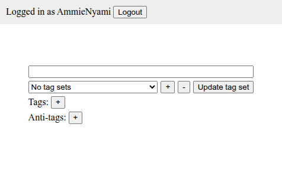

# hv

A doujin/manga manager.



Some of its features include:

- multi-user support;
- mass-importing of doujins/manga;
- searching by tag and selecting tags that shouldn't be shown in the search results ("anti-tags");
- creating sets of frequently-used tags.

Although a simple client is provided in [`./client`](./client), building custom clients is supported and even *encouraged*! **You can find the API documentation in [`./docs/API.md`](./docs/API.md).**

## Configuring

The server tries to find a configuration file either in its working directory or in the directory where the executable is located, prioritizing the file in the current working directory if present. An example configuration file is provided in [`./config.example.json`](./config.example.json).

The frontend frontend tries to find its configuration file in `/config.json`. An example configuration file is provided in [`./client/config.example.json`](./client/config.example.json).

All configuration options are explained in the configuration files as comments.

## Importing Doujins and Managing the Server

You can manage the server and import doujins using the `manage` subcommand of hv.

You can import a doujin by running `hv manage import-doujin <FOLDER>`. The doujin's folder should contain a `metadata.json` file following the format explaned by running `hv meta-format`, and a sequence of image files named from 1 to N (including the extension), with each file being a page.

Help for other commands can be found by running `hv help` and `hv manage help`.

## Quick Start

If you want a simple setup for *testing*, here's a sample setup using python's `http.server`:

In a terminal, run:

```console
$ cp config.example.json config.json # you can change this config, but the default one should work
$ go run . start
```

In another terminal, run:

```console
$ cd client
$ cp config.example.json config.json
$ python -m http.server 1313
```

With everything running, you can open the client by going to the address specified the `"api_url"` field of the client's configuration file (`./client/config.json`) in a browser.

This is not too different from a proper setup, where you would use an actual HTTP server.

## Building a Linux Binary for Distribution

To build a Linux binary that can work in any distribution without installing dependencies (i.e. static linking), you can install [musl](https://musl.libc.org/) and its tools (like `musl-gcc`) in your system and run [the provided build script](./build-dist.sh) like so:

```console
$ ./build-dist.sh
```

This will produce a binary at `./hv`.
